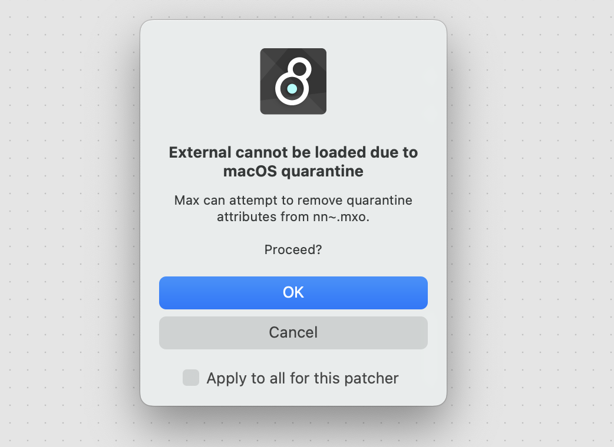
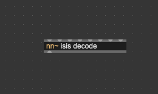
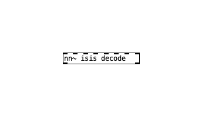
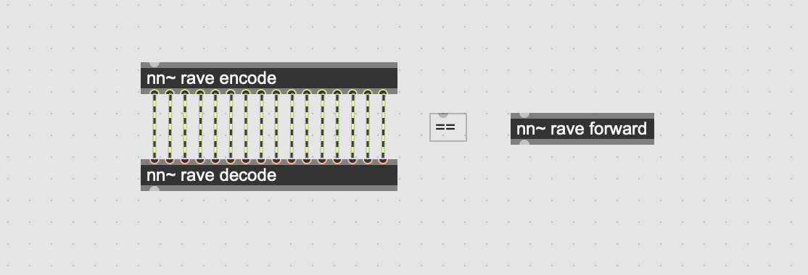
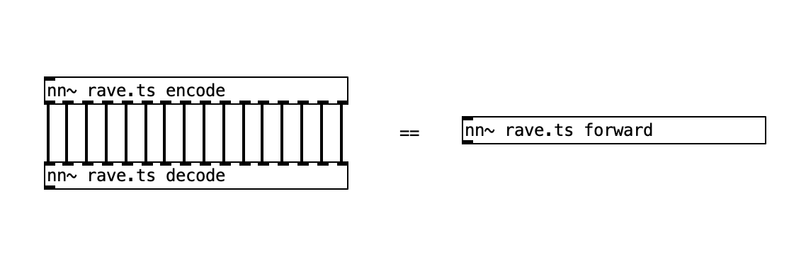
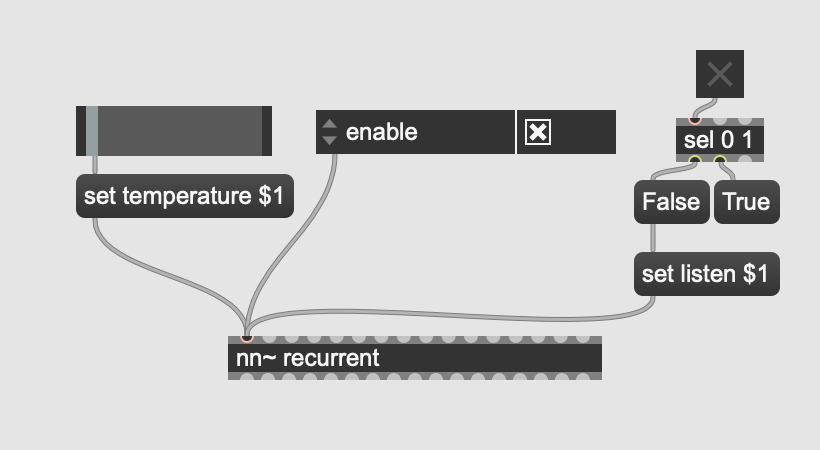
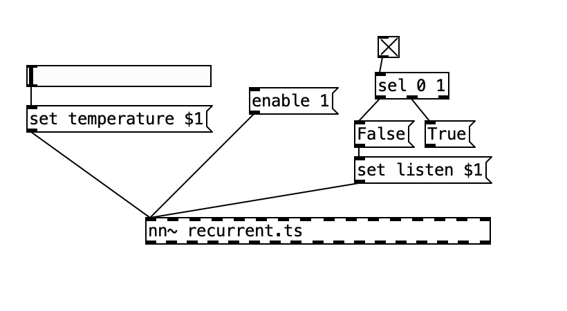
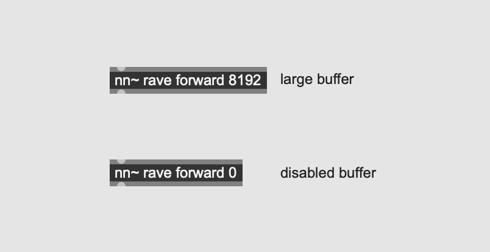
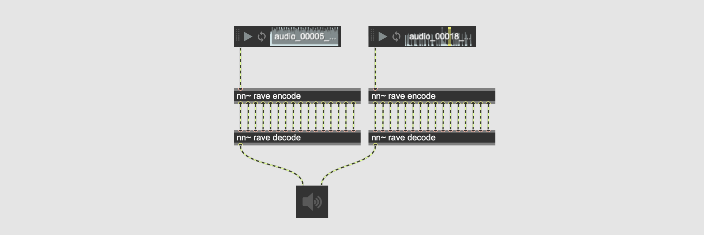

# Demonstration video

[](https://www.youtube.com/watch?v=dMZs04TzxUI)

# Installation

Grab the [latest release of nn~](https://github.com/acids-ircam/nn_tilde/releases/latest) ! Be sure to download the correct version for your installation.

**Mac users**, you should download the arm64 version if _and only if_ your Mac is a M1-2, and your installation of Max/MSP or PureData is not using Rosetta !

**Windows users**, for now it is required that all `.dll` files in the `nn~` package are copied next to the ˋMax.exeˋ executable.

## MaxMSP

Uncompress the `.tar.gz` file in the Package folder of your Max installation, i.e. in `Documents/Max 8/Packages/`.

You can then instantiate an `nn~` object. Depending on your installation, you might get a quarantine warning, such as this one



In most cases, proceeding with the removal will disable this warning until the next update of `nn~`. If MacOS continues to block the external, you might have to compile it yourself.

Right click on the `nn~` object to open the help patch, and follow the tabs to learn more about this project.

## PureData

Uncompress the `.tar.gz` file in the Package folder of your Pd installation, i.e. in `Documents/Pd/externals/`. You can then add a new path in the `Pd/File/Preferences/Path` menu pointing to the `nn_tilde` folder.

On MacOS, unlike Max/MSP, PureData doesn't include an automatic quarantine removal procedure. Therefore we have to do it manually. Fire up a terminal, and `cd` to the `nn_tilde` folder. The following command will fix the issue

```bash
xattr -r -d com.apple.quarantine .
```

# Usage

## Pretrained models

At its core, `nn~` is a translation layer between Max/MSP or PureData and the [libtorch c++ interface for deep learning](https://pytorch.org/). Alone, `nn~` is like an empty shell, and **requires pretrained models** to operate. You can find a few [RAVE](https://github.com/acids-ircam/RAVE) models [here](https://acids-ircam.github.io/rave_models_download).

Pretrained model for `nn~` are **torchscript files**, with a `.ts` extension. Create a folder somewhere on your computer, for example in

```bash
Documents/pretrained_models/
```

and add this path to Max or PureData include path (Max: `Options/File Preferences`, PureData: `File/Preferences/Path`).

## Loading a model

Once this is done, you can load a model using the following syntax (here to load a pretrained model located in `Documents/pretrained_models/decoder_only.ts`)

<table>
  <tr>
    <th width="50%">Max / MSP</th>
    <th width="50%">PureData</th>
  </tr>
  <tr>
    <td></td>
    <td></td>
  </tr>
</table>

Note that you **have** to include the `.ts` extension in the PureData version. Depending on the model loaded, there will be a different number of inlets / outlets, corresponding to the different inputs and outputs of the model.

## Selecting a method

A given pretrained model might have several different _methods_, with different effects and usage. For example, the [RAVE model](https://github.com/acids-ircam/RAVE) has three different methods, corresponding to different subparts of the model. For the sake of the example, we will describe them in the following table:

| Method name           | Description                                      | Inputs                       | Outputs                      |
| --------------------- | ------------------------------------------------ | ---------------------------- | ---------------------------- |
| **encode**            | Encodes an audio signal into a latent trajectory | audio signal                 | multiple latent trajectories |
| **decode**            | Decodes a latent trajectory into an audio signal | multiple latent trajectories | audio signal                 |
| **forward** (default) | Encodes _and_ decodes an audio signal            | audio signal                 | audio signal                 |

The user can switch between methods during instanciation by adding a second argument to `nn~` calling the desired method.

<table>
  <tr>
    <th width="50%">Max / MSP</th>
    <th width="50%">PureData</th>
  </tr>
  <tr>
    <td></td>
    <td></td>
  </tr>
</table>

## Using attributes

It is possible to configure models after their initialization using special _attributes_, whose type and effect is entirely defined by the model itself, with the exception of the `enable` attribute which can be set to either 0 or 1 to enable or disable the model, potentially saving up computation.

Model attributes can be set using _messages_, with the following syntax:

```bash
set ATTRIBUTE_NAME ATTRIBUTE_VAL_1 ATTRIBUTE_VAL_2
```

Using Max/MSP and PureData graphical objects, this can lead to an intuitive way to modify the behavior of the model, as shown below where we have two model attributes (i.e. generation temperature and generation mode), and the special `enable` attribute.

<table>
  <tr>
    <th width="50%">Max / MSP</th>
    <th width="50%">PureData</th>
  </tr>
  <tr>
    <td></td>
    <td></td>
  </tr>
</table>

The attribute list and values are again **model dependant** and should retrieved in the documentation of the model.

## Buffer configuration

Internally, `nn~` has a circular buffer mechanism that helps maintain a reasonable computational load. You can modify its size through the use of an additional integer after the method declaration, as shown below

<table>
  <tr>
    <th width="50%">Max / MSP</th>
    <th width="50%">PureData</th>
  </tr>
  <tr>
    <td></td>
    <td></td>
  </tr>
</table>

## Multicanal (Max/MSP)

The Max/MSP release of `nn~` includes additional externals, namely `mc.nn~` and `mcs.nn~`, allowing the use of the multicanal abilities of Max 8+ to simplify the patching process with `nn~` and optionally decrease the computational load.

In the following examples, two audio files are being encoded then decoded by the same model in parallel



This patch can be improved both visually _and_ computationally speaking by using `mc.nn~` and using _batch operations_


Using `mc.nn~` we build the multicanal signals **over the different batches**. In the example above, each multicanal signal will have 2 different canals. We also propose the `mcs.nn~` external that builds multicanal signals **over the different dimensions**, as shown in the example below


In the example above, the two multicanals signals yielded by the `nn~ rave encode 2` object have 16 canals each, corresponding to the 16 latent dimensions. This can help patching, while keeping the batching abilities of `mc.nn~` by creating an explicit number of inlets / oulets corresponding to the number of examples we want to process in parallel.

To recap, the regular `nn~` operates on a single example, and has as many inlets / outlets as the model has inputs / outputs. The `mc.nn~` external is like `nn~`, but can process multiple examples _at the same time_. The `mcs.nn~` variant is a bit different, and can process mulitple examples at the same time, but will **have one inlet / outlet per examples**.

## Special messages

### enable [0 / 1]

Enable / Disable computation to save up computation without deleting the model. Similar to how a _bypass_ function would work.

### reload

Dynamically reloads the model. Can be useful if you want to periodically update the state of a model during a training.

# Build Instructions

## macOS

- Download the latest libtorch (CPU) [here](https://pytorch.org/get-started/locally/) and unzip it to a known directory
- Run the following commands:

```bash
git clone https://github.com/acids-ircam/nn_tilde --recursive
cd nn_tilde
mkdir build
cd build
cmake ../src/ -DCMAKE_PREFIX_PATH=/path/to/libtorch -DCMAKE_BUILD_TYPE=Release
make
```

- Copy the produced `.mxo` external inside `~/Documents/Max 8/Packages/nn_tilde/externals/`

You can build `nn~` for PureData by adding `-DPUREDATA_INCLUDE_DIR=/Applications/Pd-X.XX-X.app/Contents/Resources/src/` to the cmake call.

## Windows

- Download Libtorch (CPU) and dependencies [here](https://pytorch.org/get-started/locally/) and unzip to a known directory.
- Install Visual Studio and the C++ tools
- Run the following commands:

```bash
git clone https://github.com/acids-ircam/nn_tilde --recurse-submodules
cd nn_tilde
mkdir build
cd build
cmake ..\src -A x64 -DCMAKE_PREFIX_PATH="<unzipped libtorch directory>"
cmake --build . --config Release
```

## Raspberry Pi

While nn~ can be compiled and used on Raspberry Pi, you may have to consider using lighter deep learning models. We currently only support 64bit OS.

Install nn~ for PureData using

```bash
curl -s https://raw.githubusercontent.com/acids-ircam/nn_tilde/master/install/raspberrypi.sh | bash
```
