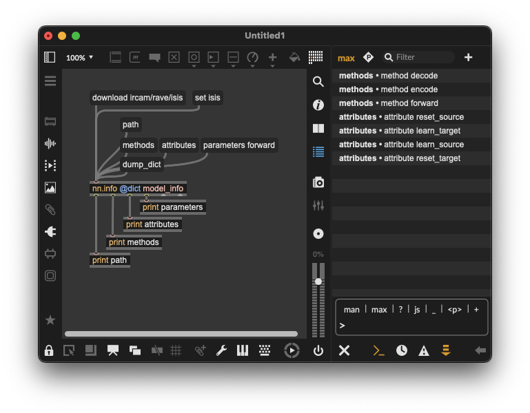
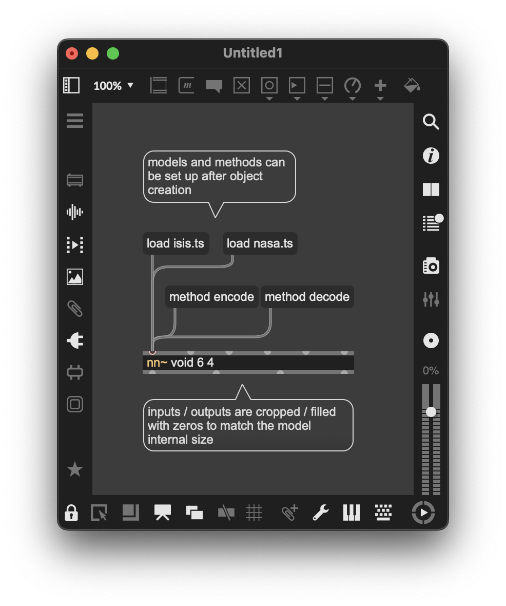

# Demonstration video

[](https://www.youtube.com/watch?v=dMZs04TzxUI)

# Installation

Grab the [latest release of nn~](https://github.com/acids-ircam/nn_tilde/releases/latest) ! Be sure to download the correct version for your installation.

## MaxMSP

Uncompress the `.tar.gz` file in the Package folder of your Max installation, i.e. in `Documents/Max [your version]/Packages/`. You can then instantiate  an `nn~` object!  Alt-click the `nn~` object to open the help patch, or access the nn~ Overview patch in the Extras menu.

##### Mac alert : codesigned with IRCAM identity and not trigger MacOS quarantine ; if it does so,  please launch in the terminal : 

```bash
cd "~/Max X/Packages/nn_tilde
sudo codesign --deep --force --sign - support/*.dylib
sudo codesign --deep --force --sign - externals/*/Contents/MacOS/*
xattr -r -d com.apple.quarantine externals/*/Contents/MacOS/*  
```

Alt+click on the `nn~` object to open the help patch, and follow the tabs to learn more about this project.

## PureData

Uncompress the `.tar.gz` file in the Package folder of your Pd installation, i.e. in `Documents/Pd/externals/`. You can then add a new path in the `Pd/File/Preferences/Path` menu pointing to the `nn_tilde` folder.

Similarly, the external should not be blocked on recent MacOS systems. It it still is, `cd` to the `nn_tilde` folder and fix with

```bash

xattr -r -d com.apple.quarantine Documents/Pd/externals/nn_tilde
sudo codesign --deep --force --sign - Documents/Pd/externals/nn_tilde/*.dylib
sudo codesign --deep --force --sign - Documents/Pd/externals/nn_tilde/nn\~.pd_darwin
```

# Usage

## Pretrained models

At its core, `nn~` is a translation layer between Max/MSP or PureData and the [libtorch c++ interface for deep learning](https://pytorch.org/). Alone, `nn~` is like an empty shell, and **requires pretrained models** to operate. Since v1.6.0, you can download them directly through Forum IRCAM API. Alternatively, you can find a few [RAVE](https://github.com/acids-ircam/RAVE) models [here](https://acids-ircam.github.io/rave_models_download) or [here](https://huggingface.co/Intelligent-Instruments-Lab/rave-models). Few [vschaos2](https://github.com/acids-ircam/vschaos2) models are also available[here](https://www.dropbox.com/sh/avdeiza7c6bn2of/AAAGZsnRo9ZVMa0iFhouCBL-a?dl=0).

Pretrained model for `nn~` are **torchscript files**, with a `.ts` extension. You can add these files to `nn_tilde/models` folders, or any place accessible through Max / Pd filesystem (Max: `Options/File Preferences`, PureData: `File/Preferences/Path`).

**New** : since v1.6.0, some models are directly downloadable through IRCAM Forum API.

Once this is done, you can load a model with `nn~` by providing its name as first argument (for example, here `isis.ts` located inside `nn_tilde/models` for Max, or among the PureData patch):  

<table>
  <tr>
    <th width="50%">Max / MSP</th>
    <th width="50%">PureData</th>
  </tr>
  <tr>
    <td></td>
    <td></td>
  </tr>
</table>

## Model information fetching

## Model information fetching

Coming with v1.6.0, the `nn.info` object allows model inspection and fetching avilable models for download on the IRCAM-API. With this object, you can get available methods and attributes for a given model. For example, you can see below that a RAVE model has three different methods : `encode`, `decode`, and `forward`.

<center>

</center>

### Methods

Models can have several _methods_, that correspond to several processing pipelines the model can achieve. Hence, each method can have a different number in inlets / outlets. The method is given as the third argument (for exemple, `decode` above), and equals `forward` by default.

### Attributes

It is possible the internal state of the module through _attributes_, that are **model-dependent** and defined at exportation. Model attributes can be set using _messages_, with the following syntax:

```bash
set ATTRIBUTE_NAME ATTRIBUTE_VAL_1 ATTRIBUTE_VAL_2
```

Using Max/MSP and PureData graphical objects, this can lead to an intuitive way to modify the behavior of the model, as shown below where we have two model attributes (i.e. generation temperature and generation mode), and the special `enable` attribute.

<table>
  <tr>
    <th width="50%">Max / MSP</th>
    <th width="50%">PureData</th>
  </tr>
  <tr>
    <td></td>
    <td></td>
  </tr>
</table>

**New in 1.6.0**

- Buffers (Max) / Array (Pd) attribute setting to allow the `.ts` model to access internal buffers / arrays.
- `torch.Tensor` attributes can be set through Max/MSP `[array]`, allowing to set attributes of unlimited size.

## Buffer configuration

Internally, `nn~` has a circular buffer mechanism that helps maintain a reasonable computational load, if the given buffer size is greater tha 0. You can modify its size through the use of an additional integer after the method declaration, as shown below. 

**Important**For Windows users, the circular buffer is automatically disabled because of a memory leak [that occurs when a TorchScript model is used in a separate thread](https://github.com/pytorch/pytorch/issues/24237). Unfortunately, this implies a much lower efficiency in terms of CPU.  

<table>
  <tr>
    <th width="50%">Max / MSP</th>
    <th width="50%">PureData</th>
  </tr>
  <tr>
    <td></td>
    <td></td>
  </tr>
</table>

## Multichannel (Max/MSP)

The Max/MSP release of `nn~` includes additional externals, namely `mc.nn~` and `mcs.nn~`, allowing the use of the multicanal abilities of Max 8+ to simplify the patching process with `nn~` and optionally decrease the computational load.

In the following examples, two audio files are being encoded then decoded by the same model in parallel


This patch can be improved both visually _and_ computationally speaking by using `mc.nn~` and using _batch operations_


Using `mc.nn~` we build the multicanal signals **over the different batches**. In the example above, each multicanal signal will have 2 different canals. We also propose the `mcs.nn~` external that builds multicanal signals **over the different dimensions**, as shown in the example below


In the example above, the two multicanals signals yielded by the `nn~ rave encode 2` object have 16 canals each, corresponding to the 16 latent dimensions. This can help patching, while keeping the batching abilities of `mc.nn~` by creating an explicit number of inlets / oulets corresponding to the number of examples we want to process in parallel.

To recap, the regular `nn~` operates on a single example, and has as many inlets / outlets as the model has inputs / outputs. The `mc.nn~` external is like `nn~`, but can process multiple examples _at the same time_. The `mcs.nn~` variant is a bit different, and can process mulitple examples at the same time, but will **have one inlet / outlet per examples**.

## Lazy mode (Max/MSP)

Since v1.6.0, nn~ has a `void` mode, that allows to initialise it with a fixed number of inlets / outlets, and may be attached to a model afterwards. This can be done with the `void` special model, that enables this lazy initialisation.

<center>

</center>

## Special messages

### enable [0 / 1]

Enable / Disable computation to save up computation without deleting the model. Similar to how a _bypass_ function would work.

### reload

Dynamically reloads the model. Can be useful if you want to periodically update the state of a model during a training.

### dump

Prints methods / attributes of the loaded model. 

### print_available_models

Prints models downloadable through API.

### download

Download a model from the API. 

### delete

Deletes a downloaded model.

### load

Change dynamically the incoming model.

### method

Change dynamically the used method.

# Scripting any PyTorch model in nn~

In the [`scripting`](https://github.com/acids-ircam/nn_tilde/tree/master/scripting) subfolder, you can find a series of examples that demonstrate how to write simple scripts to incorporate any type of deep models from PyTorch into MaxMSP (and potentially running on GPU). The examples show different use cases that also help to understand the input/output shapes relationships.
- `effects.py` : apply simple effects to the input (identical input and output shapes)
- `features.py` : compute spectral descriptors from the PyTorch audio library (each input audio buffer produces a single float as output)
- `unmix.py` : apply the unmix deep source separation model (input is split into 4 different audio streams containing « drums », « vocals », « bass » and « others »)


# Build Instructions

## macOS

- Download the latest libtorch (CPU) [here](https://pytorch.org/get-started/locally/) and unzip it to a known directory
- Run the following commands:

```bash
git clone https://github.com/acids-ircam/nn_tilde --recurse-submodules
cd nn_tilde
curl -L https://repo.anaconda.com/miniconda/Miniconda3-latest-MacOSX-arm64.sh > miniconda.sh
chmod +x ./miniconda.sh
bash ./miniconda.sh -b -u -p ./env
source ./env/bin/activate
pip install -r requirements.txt
conda install -c conda-forge curl
mkdir build
cd build
mkdir puredata_include
curl -L https://raw.githubusercontent.com/pure-data/pure-data/master/src/m_pd.h -o puredata_include/m_pd.h
export CC=$(brew --prefix llvm)/bin/clang
export CXX=$(brew --prefix llvm)/bin/clang++
cd build
cmake ../src -DCMAKE_C_COMPILER=$CC -DCMAKE_CXX_COMPILER=$CXX -DCMAKE_PREFIX_PATH=../env/lib/python3.12/site-packages/torch -DCMAKE_BUILD_TYPE=Release -DPUREDATA_INCLUDE_DIR=../puredata_include -DCMAKE_OSX_ARCHITECTURES=arm64
cmake --build . --config Release
```
please replace `arm64` in the last line by `x86_64` if you want compile for 64 bits. You can remove `-DPUREDATA_INCLUDE_DIR=../puredata_include` to compile only for Max. The Max package is produced in `src/`,  and Pd external in `build/frontend/puredata/Release`.


## Windows

- Download Libtorch (CPU) and dependencies [here](https://pytorch.org/get-started/locally/) and unzip to a known directory.
- Install [Visual Studio Redistribuable](https://learn.microsoft.com/fr-fr/cpp/windows/latest-supported-vc-redist?view=msvc-170) 
- Run the following commands (here for Git Bash):
```bash
git clone https://github.com/acids-ircam/nn_tilde --recurse-submodules
cd nn_tilde
curl -L https://download.pytorch.org/libtorch/cpu/libtorch-win-shared-with-deps-2.6.0%2Bcpu.zip > "libtorch.zip"
unzip libtorch.zip
mkdir pd
cd pd
curl -L https://msp.ucsd.edu/Software/pd-0.55-2.msw.zip -o pd.zip
unzip pd.zip
mv pd*/src .
mv pd*/bin .
cd ..
git clone https://github.com/microsoft/vcpkg.git
cd vcpkg 
./bootstrap-vcpkg.bat
./vcpkg.exe integrate install
./vcpkg.exe install curl
cd ..
mkdir build
cd build
mkdir puredata_include
curl -L https://raw.githubusercontent.com/pure-data/pure-data/master/src/m_pd.h -o puredata_include/m_pd.h
export CC=$(brew --prefix llvm)/bin/clang
export CXX=$(brew --prefix llvm)/bin/clang++
cd build
cmake ../src -G "Visual Studio 17 2022" -DTorch_DIR=../libtorch/share/cmake/Torch -DPUREDATA_INCLUDE_DIR=../pd/src -DPUREDATA_BIN_DIR=../pd/bin -A x64
cmake --build . --config Release
```
You can remove `-DPUREDATA_INCLUDE_DIR=../puredata_include` to compile only for Max. The Max package is produced in `src/`,  and Pd external in `build/frontend/puredata/Release`.

## Raspberry Pi

**not availble in v1.6.0, planned in next version ; please take previous versions if needed**

While nn~ can be compiled and used on Raspberry Pi, you may have to consider using lighter deep learning models. We currently only support 64bit OS.

Install nn~ for PureData using

```bash
curl -s https://raw.githubusercontent.com/acids-ircam/nn_tilde/master/install/raspberrypi.sh | bash
```

# Funding

This work is led at IRCAM, and has been funded by the following projects

* [ANR MakiMono](https://acids.ircam.fr/course/makimono/)
* [ACTOR](https://www.actorproject.org/)
* [DAFNE+](https://dafneplus.eu/) N° 101061548


